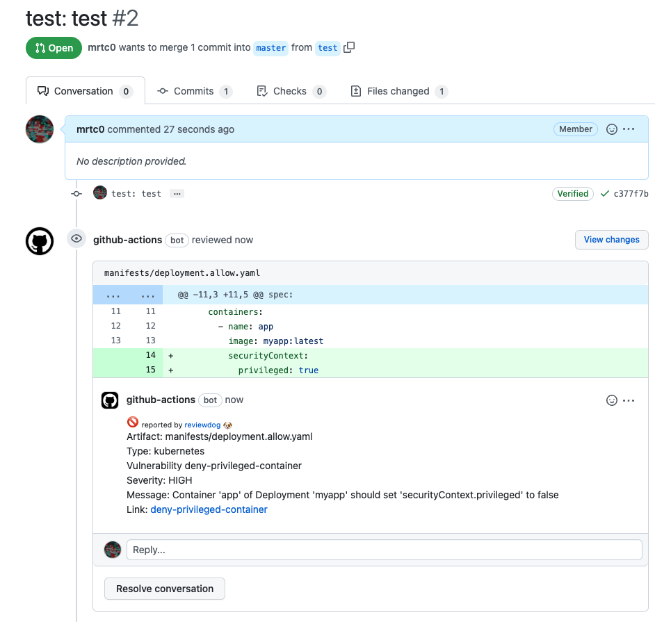

# trivy-misconf-scan

Misconfiguration Scanner with Trivy.



# Usage

### Workflow

```yaml
name: CI
on:
  - pull_request
jobs:
  test:
    name: Test
    runs-on: ubuntu-latest
    steps:
      - name: Check out source code
        uses: actions/checkout@v3

      - uses: security-actions/trivy-misconf-scan@v0.1.0
        with:
          policy-repository: 'github.com/mrtc0-sandbox/trivy-sandbox/policies'
          policy-directory: 'policy'
          namespaces: 'user'
        env:
          REVIEWDOG_GITHUB_API_TOKEN: ${{ secrets.GITHUB_TOKEN }}
```

### Inputs

| Nmae | Type | Default | Descripiton |
|:----:|:----:|:-------:|:-----------:|
| `policy-repository` | String | | Remote Policy Repository |
| `policy-directory` | String | | Specify paths to the Rego policy files directory |
| `namespaces` | String | users | Rego namespaces |

